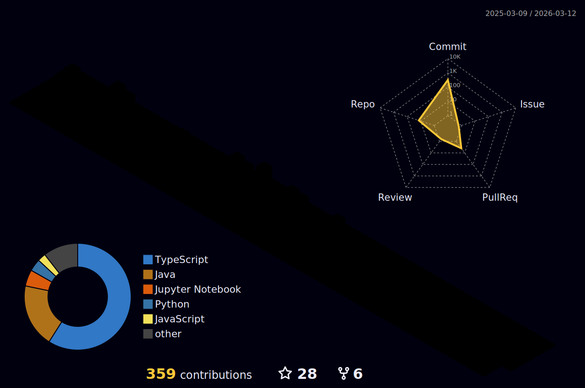
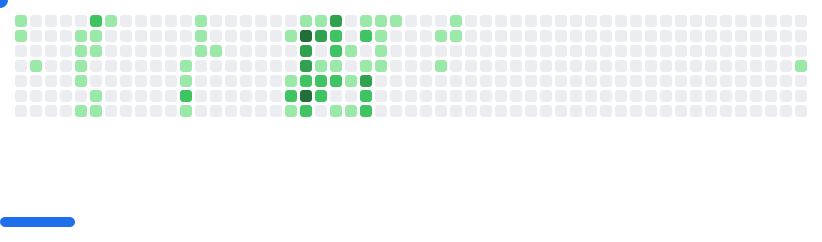

<div align="center">
  
</div>

<p align="center">
  
  
</p>

---

## 👨‍💻 About Me

<table>
<tr>
<td width="50%">

**🚀 Software Developer** with a passion for crafting digital experiences  
**☕ Turning coffee into code** since forever  

🎓 **VIT Chennai Alumnus**  
🌖 **Selenophile | Simple Ambivert**  
🙏 **Alhumdullilah Mindset**  

*"Tawfiqi illa bil-lahi alayhi tawakkaltu wa-ilayhi unibu"*  
**"And my success is not but through Allah. Upon Him I have relied, and to Him I return."**

</td>
<td width="50%">

### 🌟 Highlights
- 💡 Builder of **creative projects**: from financial dashboards → CLI toolkits → mini operating systems → retro games  
- 🎨 Strong eye for **UI/UX & Brutalist Minimalist design**  
- 🤖 Enthusiast of **AI, ML, GenAI, CV, and Deep Learning**  
- 🕹️ Loves **retro arcades** (Pac-Man, Breakout) and gamified coding ideas  
- 📚 Fascinated by **literature, philosophy and poetry** (Kafka, Dostoevsky, Parveen Shakir, Ahmed Faraz to name few)  
- 🥗 Balances **tech with fitness & keto journey**  
- 🌐 Explore about me: **[srummanf.is-a.dev](https://srummanf.is-a.dev/)**

</td>
</tr>
</table>


<div align="center">


</div>

---

## 🌐 Connect With Me

<div align="center">
  <a href="https://twitter.com/srummanf" target="_blank">
    
  </a>
  <a href="https://www.linkedin.com/in/srummanf" target="_blank">
    
  </a>
  <a href="https://www.instagram.com/ig.srummanf/" target="_blank">
    
  </a>
  <a href="mailto:rummanfardeen4567@gmail.com" target="_blank">
    
  </a>
</div>

## 📍 Hacktoberfest Memoirs
<div align="center" style="margin-top: 20px;">
  
[](https://holopin.io/@srummanf)

</div>

---

## 🛠️ Technology Stack
<div align="center">
<a href="https://skillicons.dev">
  
</a>
</div>
<details>
<summary><b>🖥️ Frontend Development</b></summary>
<br>
<div align="center">
  <a href="https://skillicons.dev">
    
  </a>
</div>
</details>
<details>
<summary><b>⚙️ Backend Development</b></summary>
<br>
<div align="center">
  <a href="https://skillicons.dev">
    
  </a>
</div>
</details>
<details>
<summary><b>🧠 AI, ML & Data Analysis</b></summary>
<br>
<div align="center">
  <a href="https://skillicons.dev">
    
  </a>
</div>
Frameworks & Libraries:

🔬 Machine Learning: TensorFlow, PyTorch, Scikit-learn
📊 Data Analysis: Pandas, NumPy, Matplotlib, Seaborn
🤖 AI/NLP: OpenAI API, Hugging Face, NLTK, spaCy
📈 Data Visualization: Plotly, D3.js, Tableau
🔍 Computer Vision: OpenCV, PIL, ImageAI
📚 Jupyter: Interactive data science and ML workflows

</details>
<details>
<summary><b>🗄️ Database & Cloud</b></summary>
<br>
<div align="center">
  <a href="https://skillicons.dev">
    
  </a>
</div>
</details>
<details>
<summary><b>🎨 Design & Tools</b></summary>
<br>
<div align="center">
  <a href="https://skillicons.dev">
    
  </a>
</div>
</details>
<details>
<summary><b>🔗 Blockchain & Web3</b></summary>
<br>
<div align="center">
  <a href="https://skillicons.dev">
    
  </a>
</div>
Web3 Technologies:

⛓️ Smart Contracts: Solidity, Ethereum, Polygon
🌐 IPFS: Decentralized storage solutions
🔧 Development: Remix IDE, Hardhat, Truffle
💳 Integration: Web3.js, MetaMask, WalletConnect

</details>


---

## 📊 GitHub Analytics

<div align="center">

[](https://wakatime.com/@9c794c5f-0863-41ab-ab1b-674e4daa46a0)



  <table>
    <tr>
      <td width="50%">
        
      </td>
      <td width="50%">
        
      </td>
    </tr>
    <tr>
      <td colspan="2" align="center">
        
      </td>
    </tr>
  </table>

### 📈 Detailed GitHub Summary


  <table>
    <tr>
      <td width="50%">
        
      </td>
      <td width="50%">
        
      </td>
    </tr>
    <tr>
      <td width="50%">
        
      </td>
      <td width="50%">
        
      </td>
    </tr>
  </table>

</div>

## 🔝 Top Contributed Repositories

<div align="center">
  
</div>


---

## 🏆 Achievements & Trophies

<div align="center">
  
</div>

---
## 💻 Coding Activity

<table>
<tr>
<td align="center">

### 🧠 LeetCode Heatmap
<a href="https://leetcode.com/u/srummanf/">
  
</a>

</td>
<td align="center">

### 🧠 LeetCode Stats
<a href="https://github.com/JeremyTsaii/leetcode-stats">
  
</a>

</td>
</tr>

<tr>
<td colspan="2" align="center">

### ⏰ WakaTime Stats
<!--START_SECTION:waka-->

```txt
From: 09 November 2025 - To: 16 November 2025

Total Time: 0 secs

No activity tracked
```

<!--END_SECTION:waka--> 
</td> 
</tr> 
</table>


---

## 📝 Latest Blog Posts

<!-- HASHNODE_BLOG:START -->
<table>
<tr>
<td width="300px">
<a href="https://srummanf.hashnode.dev/empowering-web3-ux-through-push-protocols-notification-system">

</a>
</td>
<td>
<h3><a href="https://srummanf.hashnode.dev/empowering-web3-ux-through-push-protocols-notification-system">Empowering Web3 UX through Push Protocol's Notification System</a></h3>
<p><strong>4 Jan 2024</strong></p>
<p>Welcome to our step-by-step guide on integrating Push Protocol's notification system into your NextJS web application. In this blog, we'll cover the process of initializing a user, creating a notification channel, and implementing the APIs for sending...</p>
</td>
</tr>
<tr>
<td width="300px">
<a href="https://srummanf.hashnode.dev/cracking-the-google-cloud-digital-exam-a-strategic-approach">

</a>
</td>
<td>
<h3><a href="https://srummanf.hashnode.dev/cracking-the-google-cloud-digital-exam-a-strategic-approach">Cracking the Google Cloud Digital Exam: A Strategic Approach</a></h3>
<p><strong>19 Nov 2023</strong></p>
<p>In the fast-paced world of cloud computing, earning certifications has become a valuable asset for professionals. One such coveted certification is the Google Cloud Digital Exam. In this article, I will be explaining how I cracked the exam without putting...</p>
</td>
</tr>
</table>
<!-- HASHNODE_BLOG:END -->

<div align="center">
  <a href="https://srummanf.hashnode.dev/">
    
  </a>
</div>

---

## 🎯 Fun Zone

<div align="center">

### ✍️ Random Dev Quote


### 🐍 Contribution Snake
<picture>
  <source media="(prefers-color-scheme: dark)" srcset="https://raw.githubusercontent.com/srummanf/srummanf/output/snake.svg">
  
</picture>

### 🟡👾 Pacman
<picture>
  <source media="(prefers-color-scheme: dark)" srcset="https://raw.githubusercontent.com/srummanf/srummanf/output/pacman-contribution-graph-dark.svg">
  <source media="(prefers-color-scheme: light)" srcset="https://raw.githubusercontent.com/srummanf/srummanf/output/pacman-contribution-graph.svg">
  
</picture>

### 🧱🟢🎮 Breakout Game
<picture>
  <source
    media="(prefers-color-scheme: dark)"
    srcset="images/breakout-dark.svg"
  />
  <source
    media="(prefers-color-scheme: light)"
    srcset="images/breakout-light.svg"
  />
  
</picture>

### 📈 Activity Graph
[](https://github.com/ashutosh00710/github-readme-activity-graph)

</div>

---

## 🌌 Moonlit Reflections  

> *"The phases of the moon remind us—everything is change, yet everything is whole."*  

<p align="center">
  <a href="https://moon-svg.minung.dev">
    
  </a>
  <a href="https://moon-svg.minung.dev">
    
  </a>
</p>

  
### 📊 Profile Views
  


### 💡 Let's Connect and Build Something Amazing Together!

*"The best way to predict the future is to create it"* - Peter Drucker

</div>

<div align="center">
  
</div>
