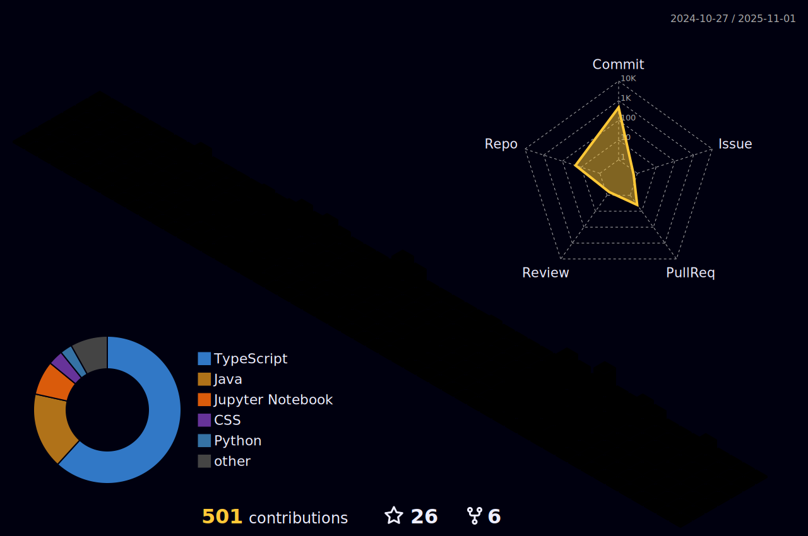
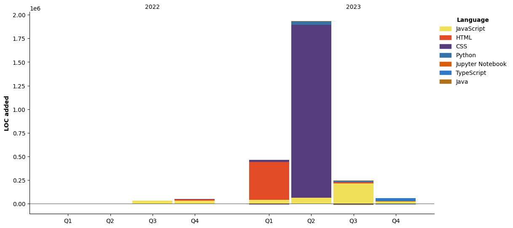

<!-- 
<div align="center">
  
</div>
-->

<div align="center">
  <h1>Shaikh Rumman Fardeen</h1>
</div>

<p align="center">
  
  
</p>

---

<div align="center">
  <!-- 
  <p>
    
  </p>
  -->
  <h3>Software Developer | UI/UX Designer | ML | AI </h3>
</div>

<div align="center">
  
**Software Developer with a passion for crafting digital experiences** 💻  
*Turning coffee into code since forever* ☕ → 💻  

VIT Chennai Alumnus 🏫 | Selenophile 🌖 | Simple Extrovert who believes in the Alhumdullilah Mindset 🙏  

*"Tawfiqi illa bil-lahi alayhi tawakkaltu wa-ilayhi unibu"*  
**"And my success is not but through Allah. Upon Him I have relied, and to Him I return."**

</div>

<div align="center">


</div>

## 🌐 Connect With Me:

<div align="center">
  <a href="https://twitter.com/srummanf" target="_blank">
    
  </a>
  <a href="https://www.linkedin.com/in/srummanf" target="_blank">
    
  </a>
  <a href="https://www.instagram.com/ig.srummanf/" target="_blank">
    
  </a>
  <a href="mailto:rummanfardeen4567@gmail.com" target="_blank">
    
  </a>
</div>

<br>

<div align="center">
  
[](https://holopin.io/@srummanf)

</div>

# 💻 Tech Stack:

<a href="https://skillicons.dev" align="center">
    
  </a>

# 👨‍💻 Leetcode Stats
<div align="center">
  <a href="https://leetcode.com/u/srummanf/">
    
  </a>
</div>


# 📊 GitHub Stats:

<div align="center">

[](https://wakatime.com/@9c794c5f-0863-41ab-ab1b-674e4daa46a0)



  
  
  

  
  
  
  
  
  [](https://github.com/JeremyTsaii/leetcode-stats)


<!-- 
# ✨ Quine Stats:

<div align="center">

[](https://quine.sh?utm_source=widgets&utm_campaign=srummanf)

[](https://quine.sh?utm_source=widgets&utm_campaign=srummanf)

[](https://quine.sh?utm_source=widgets&utm_campaign=srummanf)

</div>
-->

## 🏆 GitHub Trophies


<!-- ## 🐦 Latest Tweet
[](https://github.com/gazf/github-readme-twitter) -->

### ✍️ Random Dev Quote


### 🔝 Top Contributed Repo


## My Latest Blog Posts 👇
<!-- HASHNODE_BLOG:START -->
<p align="left">
<a href="https://srummanf.hashnode.dev/empowering-web3-ux-through-push-protocols-notification-system" title="Empowering Web3 UX through Push Protocol's Notification System"></a>
<a href="https://srummanf.hashnode.dev/empowering-web3-ux-through-push-protocols-notification-system" title="Empowering Web3 UX through Push Protocol's Notification System"><strong>Empowering Web3 UX through Push Protocol's Notification System</strong></a>
<div><strong>4 Jan 2024</strong></div>
<br/> Welcome to our step-by-step guide on integrating Push Protocol's notification system into your NextJS web application. In this blog, we'll cover the process of initializing a user, creating a notification channel, and implementing the APIs for sendin... </p> <br/> <br/>
<p align="left">
<a href="https://srummanf.hashnode.dev/cracking-the-google-cloud-digital-exam-a-strategic-approach" title="Cracking the Google Cloud Digital Exam: A Strategic Approach"></a>
<a href="https://srummanf.hashnode.dev/cracking-the-google-cloud-digital-exam-a-strategic-approach" title="Cracking the Google Cloud Digital Exam: A Strategic Approach"><strong>Cracking the Google Cloud Digital Exam: A Strategic Approach</strong></a>
<div><strong>19 Nov 2023</strong></div>
<br/> In the fast-paced world of cloud computing, earning certifications has become a valuable asset for professionals. One such coveted certification is the Google Cloud Digital Exam. In this article, I will be explaining how I cracked the exam without pu... </p> <br/> <br/>
<p align="left">
<a href="https://srummanf.hashnode.dev/build-a-blogging-website-using-node-express-and-mongodb-part-2" title="Build a Blogging website using Node, Express and MongoDB: Part 2"></a>
<a href="https://srummanf.hashnode.dev/build-a-blogging-website-using-node-express-and-mongodb-part-2" title="Build a Blogging website using Node, Express and MongoDB: Part 2"><strong>Build a Blogging website using Node, Express and MongoDB: Part 2</strong></a>
<div><strong>16 May 2023</strong></div>
<br/> In our previous blog Build a Blogging website using Node, Express and MongoDB: Part 1 (hashnode.dev), we revised the concepts of Node, Express, and EJS templating and wrote the boilerplate code for our project. In this Blog which is in continuation w... </p> <br/> <br/>
<p align="left">
<a href="https://srummanf.hashnode.dev/lets-learn-dash-a-data-visualization-framework-based-on-python-part-2" title="Let's Learn Dash - A Data Visualization Framework based on Python: Part 2"></a>
<a href="https://srummanf.hashnode.dev/lets-learn-dash-a-data-visualization-framework-based-on-python-part-2" title="Let's Learn Dash - A Data Visualization Framework based on Python: Part 2"><strong>Let's Learn Dash - A Data Visualization Framework based on Python: Part 2</strong></a>
<div><strong>13 May 2023</strong></div>
<br/> In the previous blog, we made a website that showed us the data on avocados and was quite beautiful. In continuation with the previous blog Let's Learn Dash - A Data Visualization Framework based on Python: Part 1, we are going to add styling and use... </p> <br/> <br/>
<!-- HASHNODE_BLOG:END -->

# ✨ WakaTime Stats:



<!--START_SECTION:waka-->

```txt
From: 30 July 2025 - To: 06 August 2025

Total Time: 7 hrs 22 mins

Python       3 hrs 6 mins    ██████████▓░░░░░░░░░░░░░░   42.06 %
Markdown     2 hrs 11 mins   ███████▒░░░░░░░░░░░░░░░░░   29.68 %
TypeScript   55 mins         ███░░░░░░░░░░░░░░░░░░░░░░   12.44 %
Java         33 mins         ██░░░░░░░░░░░░░░░░░░░░░░░   07.60 %
Text         14 mins         ▓░░░░░░░░░░░░░░░░░░░░░░░░   03.33 %
```

<!--END_SECTION:waka-->

<hr>


<picture>
  <source media="(prefers-color-scheme: dark)" srcset="https://raw.githubusercontent.com/srummanf/srummanf/output/pacman-contribution-graph-dark.svg">
  <source media="(prefers-color-scheme: light)" srcset="https://raw.githubusercontent.com/srummanf/srummanf/output/pacman-contribution-graph.svg">
  
</picture>


[](https://github.com/ashutosh00710/github-readme-activity-graph)

<div align="center">
  
</div>

[](https://wakatime.com/@9c794c5f-0863-41ab-ab1b-674e4daa46a0)

